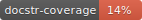

# Causal DA - Few-shot domain adaptation by causal mechanism transfer

[](https://github.com/takeshi-teshima/few-shot-domain-adaptation-by-causal-mechanism-transfer/blob/master/LICENSE)
[](#)
[](#)

## Introduction
How can we use the causal knowledge obtained by causal discovery to improve machine learning?
Are causal discovery methods beneficial for machine learning tasks?

* **Causal mechanism transfer** <sup>[1](#references)</sup>
  Domain adaptation among systems sharing the same causal mechanism
  can be performed by estimating the structural equations (reduced-form equations; estimated by nonlinear ICA).

  []

  * Theoretically well-grounded domain adaptation (generalization error bound without the partial-distribution-shift assumption).
  * Intuitively accessible transfer assumption: if the data come from the same causal mechanism, information can be transferred.
  * Method to directly leverage the estimated structural equations: via data augmentation.

## Requirements
* Python 3.6+
* See `requirements.txt` for the others.

## Install
```bash
$ pip install git+https://github.com/takeshi-teshima/few-shot-domain-adaptation-by-causal-mechanism-transfer

$ pip install -r experiments/icml2020/requirements.txt

# To reproduce the experiments of our ICML2020 paper:
$ pip install -r experiments/icml2020/requirements.txt
```

OR clone this repository and run
```bash
$ pip install .
```
and the package will be installed under the name of `causal-da` (the module name will be `causal_da`).


## Usage
[API reference](#)

## Experiments
See [experiments/README.md](experiments/README.md).

## License
This project is licensed under the terms of the [Apache 2.0 license](./LICENSE).

## References
<!-- This header title is used as an anchor tag somewhere else in this README.md -->
If you use the code in your project, please consider citing:
[1] Teshima, T., Sato, I., & Sugiyama, M. (2020). [Few-shot domain adaptation by causal mechanism transfer](https://arxiv.org/abs/2002.03497) ([ICML 2020](https://icml.cc/Conferences/2020)).

```
@inproceedings{Teshima2020Fewshot,
    author = {Teshima, Takeshi and Sato, Issei and Sugiyama, Masashi},
    booktitle = {Proceedings of the 37th International Conference on Machine Learning},
    title = {Few-shot domain adaptation by causal mechanism transfer},
    year = {2020}
}
```

## Problems?
- If you encounter any problem using the code in this repository or have suggestions for improvements, please do us a favor by ticketing an issue!

## Notes
* In case you encounter any issues regarding the requirements,
  a full list of the installed packages in a working environment can be found at `requirements-full.txt` (the output of `$ pip freeze`).
* The code released along with the paper [1] will be preserved in the branch `icml2020`.
